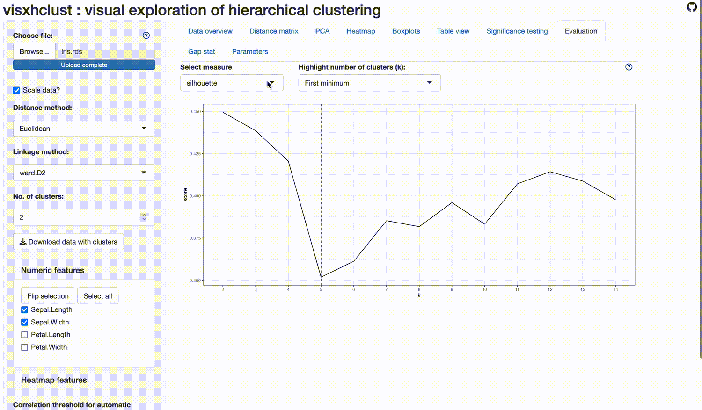

```{r, include = FALSE}
knitr::opts_chunk$set(
  collapse = TRUE,
  comment = "#>"
)
```

This is a simple visual tutorial on the basic loop of the visxhclust Shiny app -- note that almost every tab in the application has a corresponding help icon with more information and tips. To open the Shiny app you need to run:

```{r run, eval=FALSE}
library(visxhclust)
run_app()
```

## Steps for simple iteration

### Step 1: Loading data and setting parameters


### Step 2: View clustering results


### Step 3: Evaluate



### Step 4: Change parameters again


### Step 5: Review results


